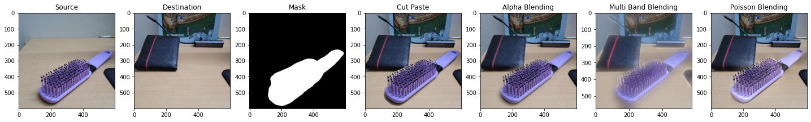
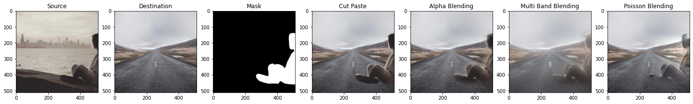

# Image Blending 
## Computer Vision Project 1

The project is the study and implementation of various image blending techniques.  
[Report](https://drive.google.com/file/d/1FlRT6DfPGNhLYh870chpRce8YPRgcdZh/view?usp=sharing) | [Colab Link](https://colab.research.google.com/drive/1Z9nT6LEYE8bmJhOqZvgOLyJxoHJIr-H1?usp=sharing) | [Youtube Video](https://www.youtube.com/watch?v=IcYnKX70wUo)

## Table of Contents
- [Packages Required](#packages-required)
- [Usage](#usage)
- [Image Blending](#image-blending-1)
- [Methods](#methods)
    - [Cut Paste](#cut-paste)
    - [Alpha Blending](#aplha-blending)
    - [Multi Band Blending](#multi-band-blending)
    - [Poisson Blending](#poisson-blending)
- [Examples](#examples)
- [References](#references)

## Packages required

You need to install the following python libraries-

- Numpy
- Matplotlib
- OpenCV

## Usage

```bash 
python blending.py source_path dest_path method_name [mask_path]
```

### Arguements-
`source_path`: Path of the source image i.e. image from where the object is to be taken  
`dest_path`: Path of the destination image i.e. scene image  
`method_name`: Method for image blending, it takes following values- `cut_paste`, `alpha`, `multi_band` & `poisson`  
`mask_path` (optional): Mask for the blending, if it is not provided you need to draw a custom mask on the source image  

## Image Blending
Image blending involves taking a portion of one image (usually an object) and placing it onto another image at a specified location in order to create a composite image that looks as natural as possible.  
Image blending has a wide range of applications in various fields, including photography, digital art, film and video production, medical imaging, and more.  

## Methods

### Cut Paste
It is a simple cutting and pasting the pixels of the source image to the destination image.  
<center></center>  
<center></center>  

### Aplha Blending
In cutting pasting, the boundaries are abrupt, thus there are visible artifacts. In this methods, we apply a gaussian blur to the mask, so that the transitions between the object image and the scene could be smooth.  
<center></center>  

### Multi Band Blending
In mMlti-Band blending we use image pyramids, which are a multi-resolution representation of an image. The pyramid is created by repeatedly subsampling the original image to create lower resolution versions, and then applying a Gaussian filter to each level to remove high frequency information. This creates a set of images with different levels of detail, which can be used in the multi-band blending process.  

<center></center>  

### Poisson Blending

*   <b>Introduction</b>:-

  *   The method was first introduced by Patrick Pérez, Michel Gangnet, and Andrew Blake in their paper titled "Poisson Image Editing" in 2003.

  *   Works by solving a Poisson equation in the region of overlap between the source and target images. The Poisson equation describes a relationship between the divergence and the gradient of a function. 

  *   In the context of image processing, the Poisson equation can be used to compute a new image that is a combination of two input images.

    

*   <b>Underlying Mathematics</b>:-

  *    In the one-dimensional case, there was only a derivative in the x-direction, but for two dimensions, we must also take into account the derivative in the y-direction.

  *    Main focus for the algorithm is to operate at the gradients level, since the pixel-wise distributions for each image differ significantly. So, necessary boundary conditions are also imposed for bounded optimization and solving the equations via Linear Systems and Energy Function, as follows:-

  $$\nabla^2 F(x,y) = \nabla \cdot G(x,y)$$

  *    $F(x,y)$ is the output image, 
  *    $G(x,y)$ is the gradient of the source image, 
  *    $∇^2$ is the Laplacian operator. 

  This equation describes how the Laplacian of the output image at any point $(x,y)$ is equal to the divergence of the gradient of the source image at that same point.

  To solve this equation, we need to define the boundary conditions at the region of overlap between the source and target images. The boundary conditions determine the values of the output image at the boundary of the overlapping region, as following:-
  
  $$F(x,y) = T(x,y)$$ 
  $$\nabla F(x,y) = \nabla \cdot G(x,y)$$
  
  For the 1st equation, (x,y) is for target image and overlapping region for 2nd equation.  

## Examples
<div style='background-color: white'>
  
  
  
  
  
  
</div>

## References
-  Lingzhi Zhang, Tarmily Wen, Jianbo Shi. (2020) Deep Image Blending https://doi.org/10.48550/arXiv.1910.11495.
- https://inst.eecs.berkeley.edu/~cs194-26/fa17/upload/files/proj6B/cs194-26-abw/
- Abhinav Kumar, Raja Sekhar Bandaru, B Madhusudan Rao, Saket
Kulkarni, & Nilesh Ghatpande. (2010). Automatic Image Alignment
and Stitching of Medical Images with Seam Blending. https://doi.org/10.5281/zenodo.1080078.
- https://en.wikipedia.org/wiki/Pyramid_(image_processing).
- https://www.cs.jhu.edu/~misha/Fall07/Papers/Perez03.pdf
- http://graphics.cs.cmu.edu/courses/15-463/2017_fall/lectures/lecture7.pdf
- https://erkaman.github.io/posts/poisson_blending.html
